# UI

**`jm:ui` is an immediate-mode UI toolkit whose every frame is data: test it with no window,
render it with no GPU, and reload it while it runs.**

- **Testable.** A frame is plain arrays with a text dump. A test clicks, types and asserts with no
  window, and CI renders pixels with no display.
- **Live.** The app runs in a child process and reloads on every build, keeping its state.
- **Three design systems.** Material 3 Expressive, Fluent 2 and GitHub Primer, generated from each
  system's own tokens and drawn in every spec state.
- **Real text.** OpenType shaping for complex scripts, bidirectional runs and exact caret stops.
- **Accessible.** Screen readers read the widgets through AccessKit on Linux, macOS and Windows.

<p align="center">
  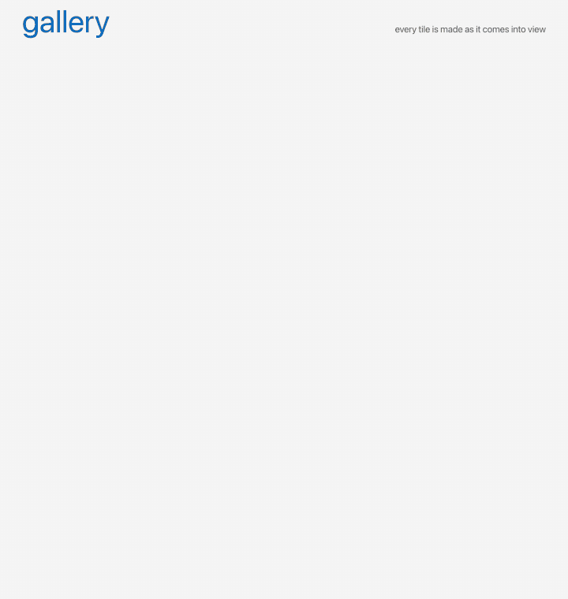
</p>

<p align="center"><sub>The gallery app, recorded headlessly: <code>ui.Probe</code> drove the real
pipeline, workers and files, and <code>ui/render</code> drew each frame. 13 seconds, played back
at the speed it ran.</sub></p>

## Quick start

Widgets nest through containers, with no per-child boilerplate:

```odin
ui.column(gtx, gap = 8)
base.label(gtx, "Name")
m3.text_field(gtx, &m.name, "Name")
if m3.button(gtx, "Save") { save(m) }
```

A container is a guard: it closes itself at the end of the block it is called in, or of the
`if` when written `if ui.row(gtx) { … }`. The explicit `ui.row_open` and `ui.close` pair is for
a body that spans procs or needs the container's handle.

Open a demo:

```sh
just material-kitchen     # every Material 3 component, a page each
just files                # a file browser over your home folder
just gallery              # ten thousand pictures made on demand
```

## The example apps

Every screenshot here is a real app rendered headlessly by jm itself.

### Files

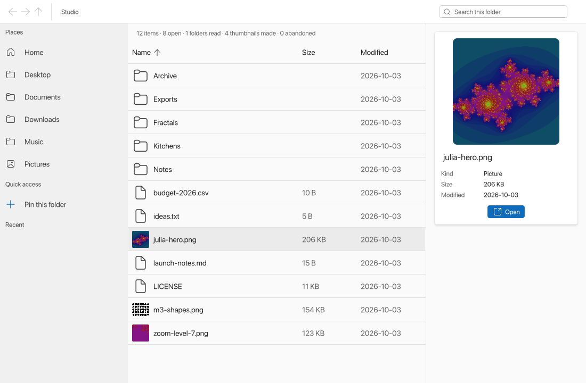

A file browser built from Fluent's own parts: a breadcrumb toolbar with search, a sortable table
with thumbnails, a details card, and a sidebar of places, pins and recent folders. Listings and
thumbnails load on worker threads as they come into view. `just files [path]` ·
`examples/files`

<details>
<summary>How it works</summary>

A folder's listing and each thumbnail are needs, read and made on worker threads as they come into
view, with Blend2D decoding the pictures. A double click on a folder goes into it, keeping the old
listing drawn until the new one lands. A double click on a file is a command the application
carries out by asking the system to open it.

The mouse's back and forward buttons, Alt with an arrow, and the toolbar's buttons walk the
folders visited. The side buttons reach the ui as keys the frame asks for app-wide, as a browser
takes them.

Pins and visits are commands the application keeps in SQLite on its own thread, a pinned pipeline
stage as in the todo app. Its commit hook re-runs the pins query, so a pin shows the moment it is
committed. Recent is a snapshot from when the sidebar first asked, so it holds still as you click.

`just files` opens the home folder, `just files <path>` another, and `just files-test` runs its
suites, the last on a real folder.

</details>

### Gallery

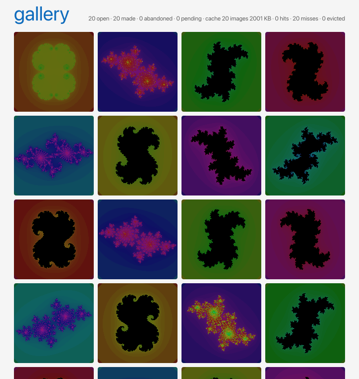

A grid of ten thousand pictures, each made on a worker thread when its row scrolls into view and
abandoned when it scrolls away. Click one to zoom it like a map, as deep as `f64` goes.
`just gallery` · `examples/gallery`

<details>
<summary>How it works</summary>

`ui.list` lays out only the rows in view, so a tile's need appears as it scrolls in and goes as it
scrolls out. The host starts a job after a short quiet, sets the job's cancel flag when the need
goes, and the generator checks the flag every row and gives up. A tile is blank for 150 ms, then a
skeleton, then its picture; the header counts what was made and what was abandoned.

A click opens the picture over the window, where the wheel zooms about the pointer and a drag pans.
The picture at each zoom level is a grid of patches, each a need of its own made on a worker as it
comes into view and given up as it leaves. The level below is kept until the new one is whole, so
the zoom streams in square by square.

A stream asks a cache before it makes a picture: the files the generator wrote, 10 MB of them,
least recently used out first and never one a frame still needs. The header counts the streams
open, the pictures made and abandoned, and the cache's images, bytes, hits, misses and evictions.

`just gallery` opens it, and `just gallery-test` runs its suites, the last against the real
workers and files.

</details>

### Todo

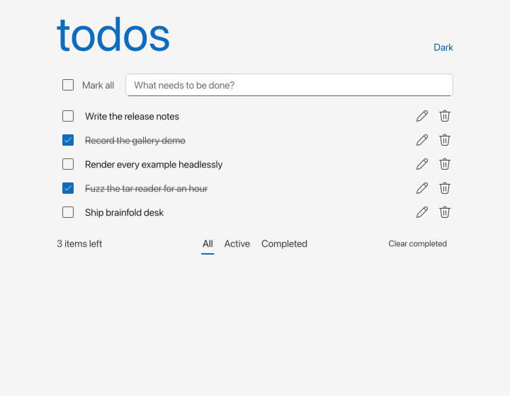

TodoMVC in Fluent, with SQLite as the data engine and a stream pipeline joining four threads. It is
the smallest complete picture of how a jm application is put together. `just todo` ·
`examples/todo`

<details>
<summary>How it works</summary>

| Package | Job |
|---------|-----|
| `shapes` | The contract |
| `view` | The frame, which imports the contract and jm:ui and nothing else |
| `logic` | The rules, pure: a request in and a write or a problem out |
| `store` | The connection and its thread, a pipeline stage pinned to it |
| `app` | The host that wires them: a worker thread for the rules and a pool for the rest |
| `main` | The window |

The store's update hook buffers each row a statement touches, and its commit hook pushes the batch
into a port; the rollback hook drops it. A need for a filter subscribes a query the pipeline re-runs
on every change batch while the need is live. Problems are never stored: a fold in the pipeline
keeps the list and delivers it as a shape.

`just test examples/todo/app` runs the view in a probe against the real pipeline, threads and
database, with no window.

```
just todo                        todo.db in the working directory
just todo -memory                a database gone when the window closes
just todo-test                   its suites, the last on real threads and a database
```

</details>

### 7GUIs

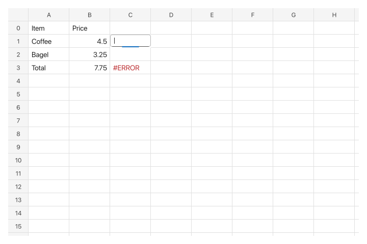

The seven tasks of the [7GUIs](https://eugenkiss.github.io/7guis/) benchmark, each a program
with its tests beside it. A task is a model struct and a ui proc, and every test drives it with
`ui.Probe` and no window. `just sevenguis <task>` opens one, `just sevenguis-test` runs every
suite, and `just sevenguis cells -png out.png` renders a first frame headlessly.

| Task | Lines | Tests | What it shows |
|------|------:|------:|---------------|
| `counter` | 35 | 20 | The model is read and written in one proc; nothing is kept in sync |
| `temperature` | 67 | 48 | Two-way binding as two `if`s, and an invalid field |
| `flight` | 82 | 68 | Constraints computed from the text each frame, and disabled controls |
| `timer` | 56 | 39 | Time as `gtx.dt`, a frame asked for only while it runs, a test stepping time |
| `crud` | 138 | 63 | A filtered list derived in the frame, not cached beside the data |
| `circles` | 228 | 101 | A canvas from core ops, a context menu, a popover, undo as a list of actions |
| `cells` | 510 | 188 | 2,727 cell widgets a frame in a two-way scroll box, editing in place, a formula engine tested without ui |

Lines count comments. The shared window and theme are `examples/7guis/shell`, 48 lines.

### Design-system kitchens

| Material 3 Expressive | Fluent 2 | Primer |
|:---:|:---:|:---:|
| 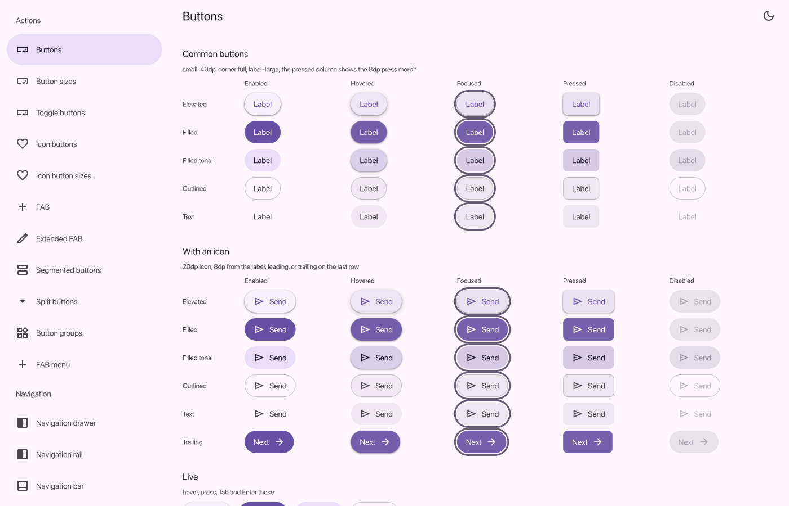 | 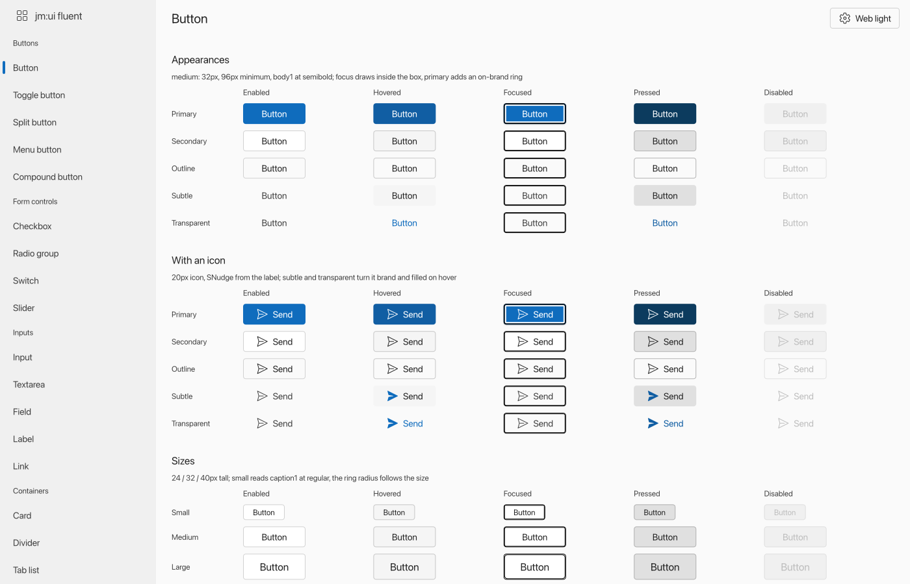 | 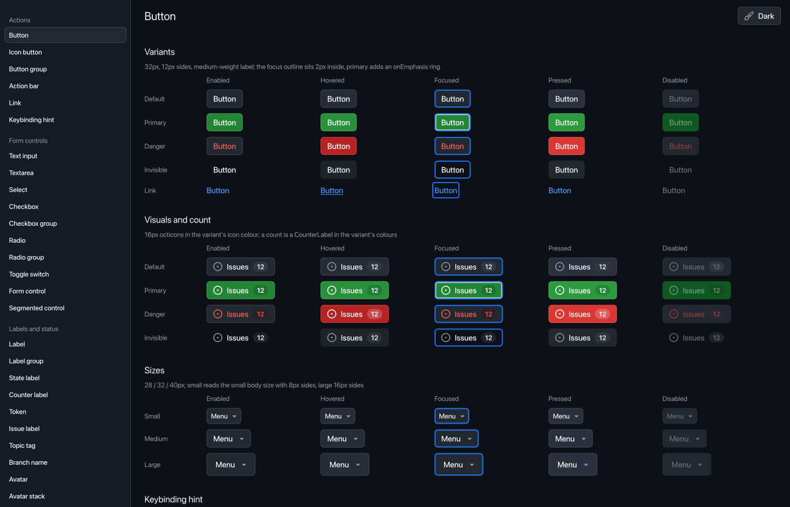 |
| `just material-kitchen` | `just fluent-kitchen` | `just primer-kitchen` |

Each kitchen shows every component of its system, a page each, in all its spec states. Fluent shows
all five of its themes and Primer all fourteen. `just material-png Chips` and its siblings
render one page to `build/`. The sources are `examples/material-kitchen`,
`examples/fluent-kitchen` and `examples/primer-kitchen`.

### Text lab

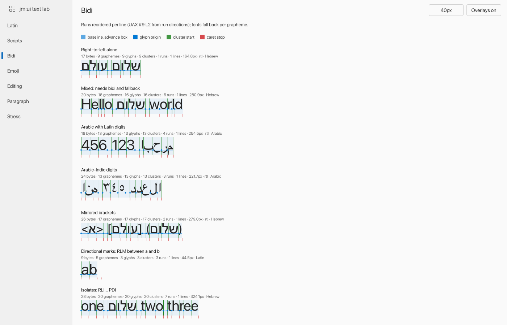

Text specimens in many scripts and directions, with the shaper's clusters, glyph origins and caret
stops drawn over them. `just text-lab`, or `just text-png Scripts` for one page ·
`examples/text-lab`

> [!NOTE]
> The lab draws a script in the default font when no installed font covers it. On a machine
> without Noto fonts, several of its script samples show missing-glyph boxes.

### Hot-reload demos

| Live architecture diagram | The subprocess split |
|:---:|:---:|
| 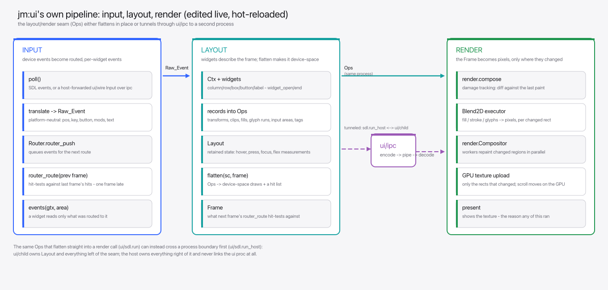 | 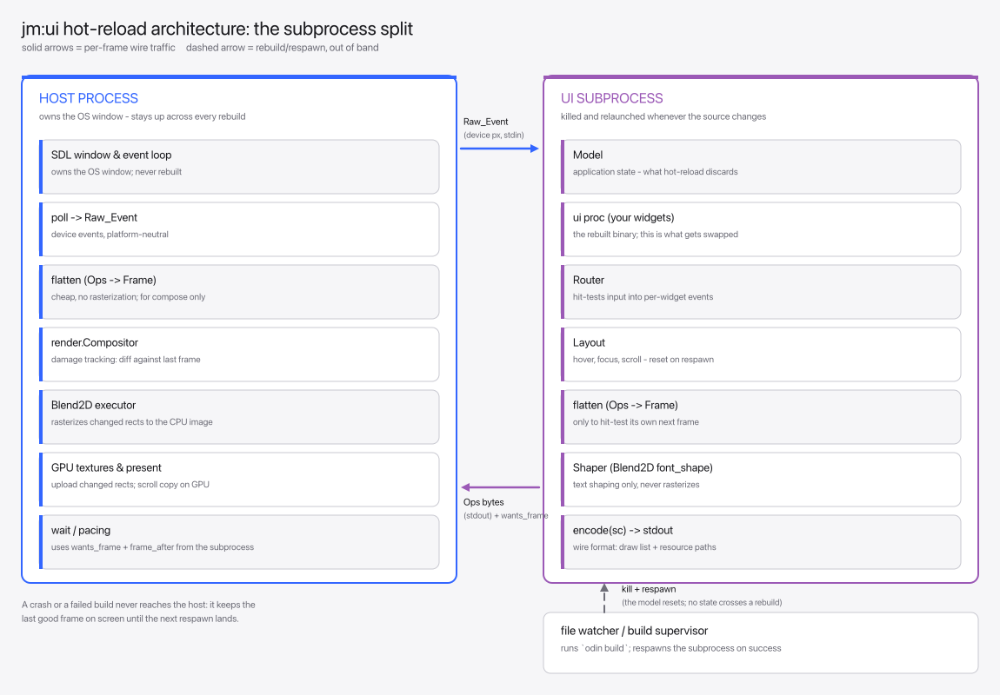 |
| `just hot-architecture` | `examples/hotreload-diagram` |

`examples/hot-architecture` is a live-editable diagram of jm:ui's own pipeline, and
`examples/hot-counter` is the smallest hot-reloaded app: a two-binary click counter.

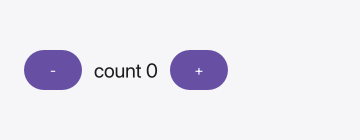

## Test it without a window

Every stage of a frame is an array with a text dump, so a frame can be asserted on, serialized (`encode`)
for a renderer in another process, or driven by `ui.Probe` with no window at all.

```
build/debug/material-kitchen-child -page Buttons -dump          the scene as text
build/debug/material-kitchen-child -page Menus -click Edit -events   click by tag, list what it routed
build/debug/material-kitchen-child -page Buttons -png out.png   render it headlessly
```

| To check | Use | Why |
|----------|-----|-----|
| Structure and text | `-dump` | Free of vision tokens, and enough for most bugs |
| Pixels | `-png` | When the question is actually about pixels |
| What changed | `tools/img-diff` | Turns two PNGs into a list of changed regions as text |

`tools/img-diff` is built over `ui/render`'s `diff_files`. Confirming an edit changed what it
should needs looking at neither picture.

## Data in, data out

A frame is a function of plain data, and the data goes both ways.

| Direction | What crosses |
|-----------|--------------|
| In | The host's input, and shapes: the answers to what the frame needed |
| Out | The scene, what to persist, requests of the platform (clipboard, a URL), needs, and commands |

A **need** is a query the frame records with `ui.need` and reads the delivered shape for. A
**command** is a value for the application to process, sent with `ui.command`. The application
never addresses the ui, so a row scrolled out of view releases its avatar with no cleanup in the
widget.

```odin
page, status := ui.need(gtx, shapes.Users_Page{page = m.page, size = 50}, shapes.Users_Page_Result)
if status == .Missing || status == .Loading { skeleton(gtx); return }
for row in page.rows {
	s := ui.scope_open(gtx, row.id); defer ui.scope_close(&s)
	avatar, av := ui.need(gtx, shapes.Avatar{user = row.id, px = 48}, shapes.Avatar_Result)
	if m3.button(gtx, "Delete") { ui.command(gtx, shapes.Delete_User{id = row.id}) }
}
```

<details>
<summary>Under the hood: how needs and commands travel</summary>

A need is a value of a type the application's contract declares. Needs and commands cross the
boundary as kind and cbor bytes, so `ui` knows nothing of the contract's types. The application
answers needs through an `Inbox` from any thread and sees commands through a `Data_Host` on the
loop's thread.

The need set is rebuilt every frame and `Subscriptions` diffs it, so a host starts what appeared
and cancels what went. `ui/sdl`'s `App` and `Host_App` and `ui/child`'s `App` each carry a
`Data_Host`. Over the hot-reload wire the child sends its need diff and commands with each reply,
and the host's answers ride the next input, so the application can live in either process.

`ui.Probe` delivers shapes and reads needs and commands, which is how a frame is tested with no
application linked: `ui/need_test.odin` is the model.

</details>

## Hot reload

A host owns the window and renders. A subprocess owns the model and the ui proc, and the host
respawns it whenever a build succeeds. The window never closes and a crash in the app never takes
it down.

`just material-kitchen`, `just fluent-kitchen` and `just text-lab` build and open their own host.
`just hot-architecture` builds its host and prints the two commands that run it.

<details>
<summary>Under the hood: the host, the child and the watcher</summary>

The host is `ui/sdl.run_host`. The subprocess (`ui/child`) owns the Model, the ui proc, `Router`
and `Layout`, and the two talk `ui/wire`'s Input/Reply over `ui/ipc`'s pipes.

`Host_App.watch` names a pointer file a builder republishes on every successful build;
`tools/hot-watch` is one. The host re-reads it and respawns the child on a change, never
overwriting a running executable in place, which Windows refuses.

`tools/hot-watch` takes extra directories to watch after the pointer file, so a child rebuilds when
the `ui` package it imports is edited too. With `-host` it rebuilds the host as well, which
restarts itself when the ops encoding changed under it. `just fluent-kitchen` and
`just material-kitchen` also watch `examples/kitchen`, the state grid, session and command line
both kitchens draw on.

</details>

## Design systems

`ui` itself has layout, input, text and paint, and no look of its own. The design systems sit on
the shared `ui/design` layer.

| Package | What it is |
|---------|------------|
| `ui/base` | The smallest design system: a checked palette, label, divider, panel |
| `ui/material` | Material 3 Expressive, in full |
| `ui/fluent` | Fluent 2, in full |
| `ui/primer` | GitHub's Primer, in full |

A zero field in a style struct takes the theme's value.

## How a frame is drawn

A ui proc records scene ops. `flatten` turns them into a draw list and a hit list. `ui/render`
executes the draw list on Blend2D while the router hit-tests the hit list.

<details>
<summary>Under the hood: rendering, text and accessibility</summary>

**Clipping** is exact for any shape under any affine. Blend2D clips only to rectangles, so a path
or rotated clip renders through an A8 mask.

**Blend2D.** The binding is copied from `odin-blend2d`. `just blend2d` fetches the upstream Blend2D
and asmjit commits it was generated from and builds the archive. Its foreign import names the C++
runtime, so `-collection:jm=` alone builds a program that links it.

**Text** is shaped by kb_text_shape, vendored upstream at a pinned commit in `ui/kb/vendor` (zlib
licence). `just kb` builds it, and `JM_UI_SHAPER=blend2d` shapes with Blend2D's own shaper
instead, to compare.

**Accessibility.** Assistive technology reads the widgets' semantics (`ui.semantics`) through
AccessKit (`ui/accesskit`, Apache-2.0 or MIT). `just accesskit` fetches the upstream release's
prebuilt library rather than building it, so no Rust toolchain is needed:

| Platform | Library | Protocol |
|----------|---------|----------|
| Linux | static archive | AT-SPI2 |
| macOS | static archive | NSAccessibility |
| Windows | DLL beside the executable | UI Automation |

</details>

## See also

- [Packages](packages.md): every `ui/…` package and what it does
- [Streams](streams.md): the pipelines the example apps run on
- [Building and testing](building.md): the UI recipes and release builds
